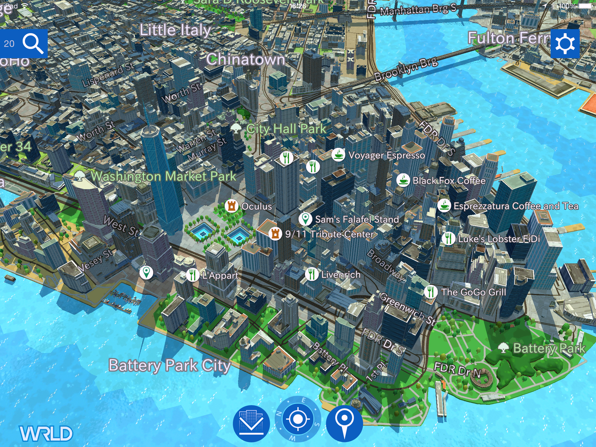

eeGeo POI REST API v1.1
==================

This document describes version 1.0 of the eeGeo POI REST API for submitting and managing custom Points of Interest. The POI API is primarily intended for use with [eegeo-example-app](http://github.com/eegeo/eegeo-example-app).

---

## Quick Start

1. Obtain a Developer Authentication Token by signing up at [https://www.eegeo.com/developers/](https://www.eegeo.com/developers/)
2. Create an Application API Key at [https://www.eegeo.com/developers/](https://www.eegeo.com/developers/)
3. [Create a new POI Set](#newpoiset)
4. [Associate your Application API Key with your newly created POI Set](#associate)
5. [Add POIs to your POI Set](#createpoi)
6. Perform [Free-Text, Category or Indoor](#search) queries

---

Full POI API Specification
==========================

#### Authentication Token

Obtain a Developer Authentication Token by signing up at [https://www.eegeo.com/developers/](https://www.eegeo.com/developers/). The Developer Authentication Token allows you to make authenticated requests against the POI service.

The Authentication Token will be referred to as ```dev_auth_token``` throughout this README

#### Application API Key

The Application API Key is the API key used to authenticate the eeGeo SDK. Application Keys can be associated with POI sets, providing that application access to the POI set. Obtain Application API keys from [https://www.eegeo.com/developers/](https://www.eegeo.com/developers/).

Application API Keys will be referred to as ```app_api_key``` throughout this README

#### POI Sets

A POI Set is a collection of Points of Interest. You can associate multiple Application API keys with POI Sets, allowing multiple applications or platforms access to the same POI Set.

A POI Set is a JSON object with the following attributes:

|Field|Type|Description|
 --- | --- | ---
|`id`|integer| a unique identifier for the poi set, this is generated for you
|`name`|string| an appropriate name for the poi set
|`api_key_permissions`|string list| app api keys that have access to this poi set

##### <a name="newpoiset"></a>Create a POI Set

To create a new POI Set, make a RESTful request passing the name of the POI set:

```sh
$ curl -v -XPOST https://poi.eegeo.com/v1.1/poisets/?token=dev_auth_token -d '{"name":"my-poi-set"}'
```

The response will be a JSON object specifying the newly created POI Set:

```json
{
"id":1, 
"name":"my-poi-set", 
"api_key_permissions":[]
}
```

Make note of the POI Set ID, in this case ```1``` as this is used to make future requests against this newly created POI Set.

##### Query all POI sets

All POI Sets you own can be listed by making a RESTful request to the poisets resource:

```
$ curl -v https://poi.eegeo.com/v1.1/poisets/?token=<dev_auth_token>
```

This will return a collection of all POI Sets you own

##### Query a POI set

To query an individual POI Set, make a RESTful request to the poiset:

```
$ curl -v https://poi.eegeo.com/v1.1/poisets/<SID>?token=<dev_auth_token>
```

Where ```<SID>``` is the POI Set ID to query. This will return the POI Set as JSON.

##### Delete a POI Set

To delete a POI Set, make a RESTful request to the poiset:
```
$ curl -v -XDELETE https://poi.eegeo.com/v1.1/poisets/<SID>?token=<dev_auth_token>
```
Where ```<SID>``` is the POI Set ID to delete.

##### <a name="associate"></a>Associate App API Key

Application API Keys can be associated with a POI Set to provide that Application access to the POIs in the POI Set.

To do this, make a RESTful call:

```sh
$ curl -v -XPOST https://poi.eegeo.com/v1.1/poisets/<SID>?token=<dev_auth_token> -d '{"apikey":"<app_api_key>"}'
```

Where ```app_api_key``` is the Application API Key, and where ```<SID>``` is the POI Set ID to add the Application API Key to.

##### Unassociate App API Key

To unassociate an Application API Key from a POI Set, perform the following RESTful call:

```sh
$ curl -v -XDELETE https://poi.eegeo.com/v1.1/poisets/<SID>/<app_api_key>?token=<dev_auth_token>
```

Where ```app_api_key``` is the Application API Key, and where ```<SID>``` is the POI Set ID to remove the Application API Key from.

---
Points of Interest
==================

#### POI

A POI is a Point of Interest. POIs are added to POI Sets and can be searched by applications with access to that POI Set.

The default POI and default taxonomy is supported by [eegeo-example-app](http://github.com/eegeo/eegeo-example-app) - however both the POI API and eegeo-example-app can be customised, so if the default behaviour does not meet your needs you can change the behaviour to suit.

A POI is a JSON object with the following attributes:

|Field|Required|Empty|Type|Description|
 --- | --- | --- | --- | ---
|`id`|generated|no|integer| a unique identifier for the poi, this is generated for you
|`title`|requied|no|string| an appropriate title for the poi (i.e. place name)
|`subtitle`|required|yes|string| an appropriate subtitle for the poi (i.e. address)
|`tags`|required|yes|string| a whitespace separated list of [tags](#tags)
|`lat`|required|no|decimal| wgs84 decimal degrees latitude
|`lon`|required|no|decimal| wgs84 decimal degrees longitude
|`height_offset`|optional|no|decimal| height in metres of poi above ground level (default: 0.0)
|`indoor`|optional|no|boolean| whether poi is indoor (default: false)
|`indoor_id`|optional|yes|boolean| the id of the indoor map the poi belongs to (default: empty)
|`floor_id`|optional|no|integer| the floor_id of the indoor map the poi belongs to (default: 0)
|`user_data`|optional|yes|json| a json object of custom user data (default: empty)

The ```user_data``` attribute is entirely custom, however in [eegeo-example-app](http://github.com/eegeo/eegeo-example-app) the following default ```user_data``` attributes are supported:

|Field|Type|Description|
 --- | --- | ---
|`image_url`|string| a url to an image to display for the poi
|`phone`|string| a phone number for the poi
|`web`|string| a website for the poi
|`description`|string| a description for the poi
|`highlight`|string| id of the highlight to enable for a poi
|`highlight_color`|array| highlight color defined as an [R,G,B,A] int array (0-255)
|`entity_highlight`|array| string array of entities to highlight for poi
|`entity_highlight_color`|array| entity highlight color defined as [R,G,B,A] int array (0-255)

##### <a name="createpoi"></a>Create a new outdoor POI

To create a new POI, make the following RESTful call:

```sh
$ curl -v -XPOST https://poi.eegeo.com/v1.1/poisets/<SID>/pois/?token=<dev_auth_token> -d '{
  "title":"eeGeo Dundee",
  "subtitle":"Suite 2, Westport House",
  "tags":"office business",
  "lat":56.459937,
  "lon":-2.978124
}'
```

Where ```<SID>``` is the POI Set ID to add the POI to. 

##### Update an existing POI

To update attributes of an existing POI, make the following RESTful call:

```sh
$ curl -v -XPUT https://poi.eegeo.com/v1.1/poisets/<SID>/pois/<PID>?token=<dev_auth_token> -d '{
  "title":"A new Title",
  "subtitle":"A new Subtitle"
}'
```

Where ```<SID>``` is the POI Set ID the POI belongs to, and ```<PID>``` is the ID of the POI

##### Deleting POIs

To delete an existing POIs in a POI set, make the following RESTful call:

```sh
$ curl -v -XDELETE https://poi.eegeo.com/v1.1/poisets/<SID>/pois/PID?token=<dev_auth_token>
```

Where ```<SID>``` is the POI Set ID the POI belongs to, and ```<PID>``` is the ID of the POI

To delete all POIs in a POI set, make the following RESTful call:

```sh
$ curl -v -XDELETE https://poi.eegeo.com/v1.1/poisets/<SID>/pois/?token=<dev_auth_token>
```

Where ```<SID>``` is the POI Set ID the POIs belong to.

##### Querying POIs

To query POIs in a POI set, make the following RESTful calls:

```sh
$ curl -v https://poi.eegeo.com/v1.1/poisets/<SID>/pois/?token=<dev_auth_token>
$ curl -v https://poi.eegeo.com/v1.1/poisets/<SID>/pois/PID?token=<dev_auth_token>
```

Where ```<SID>``` is the POI Set ID the POIs belong to, and ```<PID>``` is the ID of the POI

#### Indoor POI

Indoor POIs are supported by default in [eegeo-example-app](http://github.com/eegeo/eegeo-example-app). To create an indoor POI three optional attributes must be defined when creating the POI:

|Field|Type|Description|
 --- | --- | ---
|`indoor`|boolean| whether poi is indoor (default: false)
|`indoor_id`|boolean| the id of the indoor map the poi belongs to (default: empty)
|`floor_id`|integer| the floor_id of the indoor map the poi belongs to (default: 0)

The ```indoor_id``` is the id of the indoor map. See [indoor-map-api](http://github.com/eegeo/indoor-map-api) for more details.

##### Create a new indoor POI

To create a new POI, make the following RESTful call:

```sh
$ curl -v -XPOST https://poi.eegeo.com/v1.1/poisets/<SID>/pois/?token=<dev_auth_token> -d '{
  "title":"Primark",
  "subtitle":"Overgate",
  "tags":"clothing shopping",
  "lat":56.460189,
  "lon":-2.971023,
  "indoor":true,
  "indoor_id":"overgate_dundee",
  "floor_id":0
}'
```

Where ```<SID>``` is the POI Set ID to add the POI to. 

#### Tags

The ```tags``` property of a POI is flexible. You can define your own taxonomy and categorisation to suit your need. However, the ```tags``` field in the POI must fulfil the following requirements:

1. All tags must be separated by one whitespace. Eg: ```"services office business"```
2. Each tag may only contain lowercase alpha characters and/or underscore if required. Numbers are not allowed. Eg: ```"restaurant bar food_drink"```
3. Tags are ordered from the most specific first to least specific. Eg: ```"burgers restaurant bar food_drink"```, therefore that particular POI is best described as a __burger__ joint and least described by __food_drink__, even though all the tags are relevant to the POI

#### Default Tags

A default set of high level tags is provided in [eegeo-example-app](http://github.com/eegeo/eegeo-example-app). The categories supported are:

|Category|Examples|
 --- | ---
|`accommodation`| hotels, bed & breakfast, resorts
|`art_museums`| art galleries, museums, cultural centres
|`business`| local businesses, professional services, offices
|`entertainment`| cinemas, festivals, venues
|`food_drink`| restaurants, cafes, diners
|`amenities`| banks, services, information
|`health`| doctors, emergency services, 
|`shopping`| shops, stores, supplies, centres
|`sports_leisure`| recreational, parks, sports activities
|`tourism`| tours, tourist spots, landmarks
|`transport`| airports, public transport, trains

---

<a name="search"></a>Searching
=========

#### Free Text Search

To perform free text search, perform the following query:

```sh
$ curl -v "https://poi.eegeo.com/v1.1/search?s=eeGeo&lat=56.460189&lon=-2.971023&apikey=<app_api_key>"
$ curl -v "https://poi.eegeo.com/v1.1/search?s=eeGeo&lat=56.460189&lon=-2.971023&r=10&apikey=<app_api_key>"
$ curl -v "https://poi.eegeo.com/v1.1/search?s=eeGeo&lat=56.460189&lon=-2.971023&n=1&apikey=<app_api_key>"
```

Where ```<app_api_key>``` is an Application API Key that has permission to access a POI Set.

Permitted arguments to the query are:

|Field|Required|Type|Description|
 --- | --- | --- | ---
|`s`|required|string| the search term
|`lat`|required|decimal| wgs84 decimal degrees latitude of the query
|`lon`|required|decimal| wgs84 decimal degrees longitude of the query
|`r`|optional|decimal| radius of the search query in metres (default: 1000.0)
|`n`|optional|integer| maximum number of results to return (default: 20)
|`ms`|optional|decimal| minimum 'score' to results. the higher the number the fewer results will be matched  (default: 0.0)

#####  Result Ordering and Scoring

Results are ordered by score. Scored is a measure of _closeness_ to the input query. This measurement of this closeness is complex and subject to change. But the following are factors:

1. Lexical distance from the search query
2. Distance from the query origin

#### Tags Search

To perform a tag search, perform the following query (searches for: ```"office business"```):

```sh
$ curl -v "https://poi.eegeo.com/v1.1/tag?t=office%20business&lat=56.460189&lon=-2.971023&apikey=<app_api_key>"
```

Where ```<app_api_key>``` is an Application API Key that has permission to access a POI Set.

Permitted arguments to the query are:

|Field|Required|Type|Description|
 --- | --- | --- | ---
|`t`|optional|string| the tag(s) to search for. If not specified it will return all POIs it finds
|`lat`|required|decimal| wgs84 decimal degrees latitude of the query
|`lon`|required|decimal| wgs84 decimal degrees longitude of the query
|`r`|optional|decimal| radius of the search query in metres (default: 1000.0)
|`n`|optional|integer| maximum number of results to return (default: 20)

#### Indoor Map constrained Category Search

To perform a category search, constrained to a particular indoor map, perform the following query:

```sh
$ curl -v "https://poi.eegeo.com/v1.1/indoor?i=<indoor_map_id>&t=office%20business&f=3&apikey=<app_api_key>"
```

Where ```<app_api_key>``` is an Application API Key that has permission to access a POI Set and ```<indoor_map_id>``` is the indoor map to constrain against.

Permitted arguments to the query are:

|Field|Required|Type|Description|
 --- | --- | --- | ---
|`i`|required|string| the indoor map ID to constrain against
|`f`|required|integer| the floor number of the origin of the search, starting at 0 for the lowest floor
|`t`|optional|string| the tag(s) to search for. If not specified it will returbn all POIs it finds
|`n`|optional|integer| maximum number of results to return (default: 20)
|`s`|optional|integer| floor score drop off, i.e. the number of floors to search above and below (default: 15)

---

#### Bulk API

It is possible to make Bulk updates to the POI API to reduce round trips. The Bulk API allows create, update and delete operations to be performed against a POI Set.

To use the Bulk API, make queries of the following form:

```sh
$ curl -v -XPOST https://poi.eegeo.com/v1.1/poisets/<SID>/bulk/?token=<dev_auth_token> -d '{
    "create": [{ 
      "title" : "West House", 
      "subtitle" : "2 West Port, Dundee DD1 5EP", 
      "tags" : "bar food_drink",
      "lat" : 56.459336, 
      "lon" : -2.977645,
      "height_offset" : 0.1
    },
    { 
      "title" : "eeGeo Dundee", 
      "subtitle" : "Westport House", 
      "tags" : "office business",
      "lat" : 56.459941, 
      "lon" : -2.978211,
      "height_offset" : 0.1,
      "indoor" : true,
      "indoor_id" : "westport_house_interior_id",
      "floor_id" : 3
    }],

    "update": [{ 
      "id" : 1,
      "title" : "West House", 
      "subtitle" : "2 West Port, Dundee DD1 5EP", 
      "tags" : "office business",
      "lat" : 56.459336, 
      "lon" : -2.977645,
      "height_offset" : 0.1
    }],

    "delete": [1,2,3,4,5]
}'
```

Where ```<SID>``` is the POI Set ID to perform the Bulk Operation on.

---

#### Disclaimer
This is an early version of the POI API.  eeGeo Ltd reserves the right to make changes to the API and its documentation at any time.  

---

#### Contact us
If you have any problems or queries please [raise an issue](https://github.com/eegeo/poi-api/issues/new).

